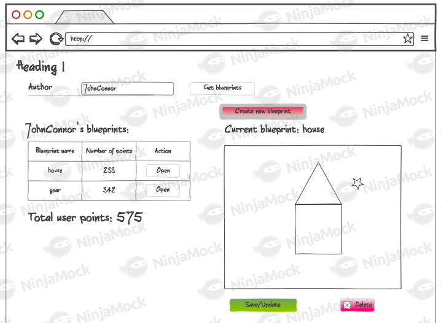
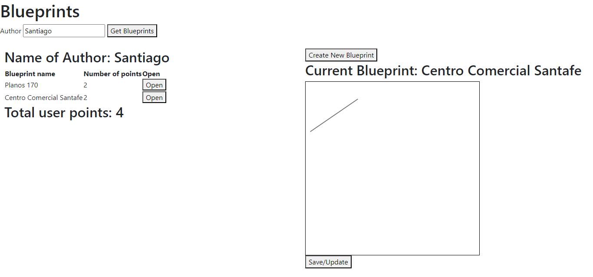
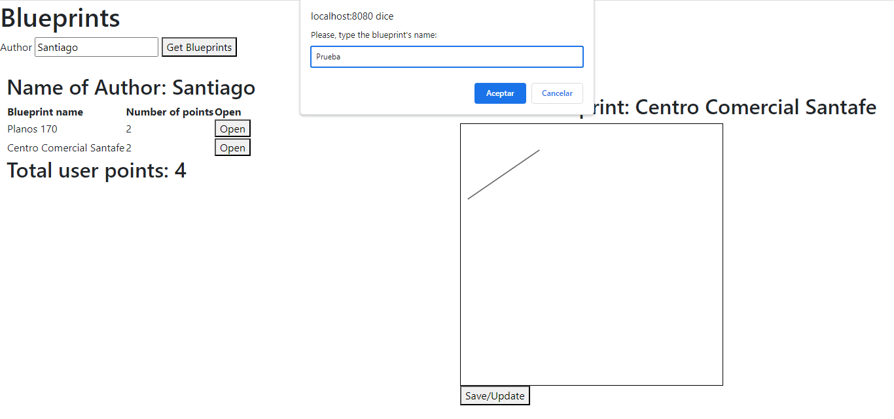
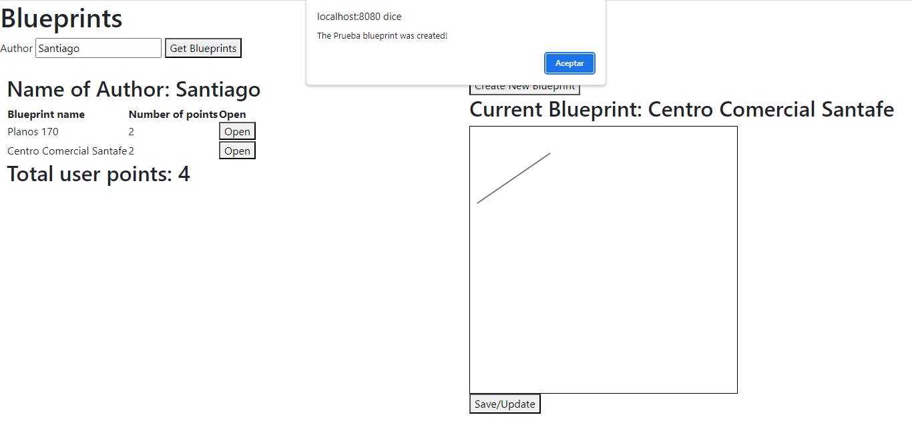
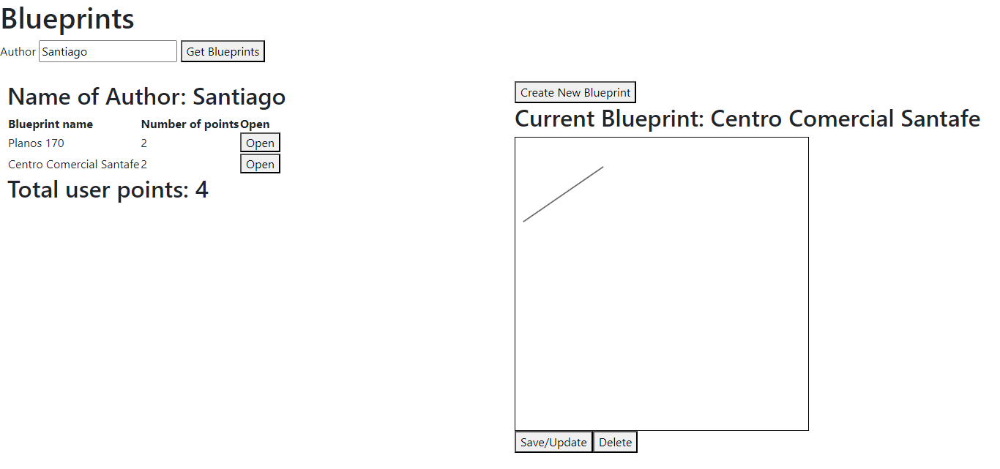
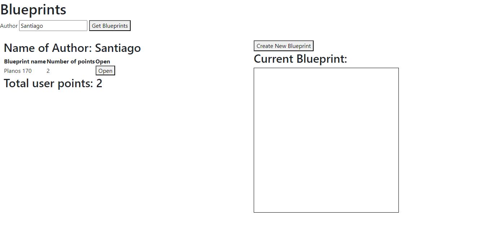

#### Escuela Colombiana de Ingeniería
#### Procesos de desarrollo de software - PDSW
#### Construción de un cliente 'grueso' con un API REST, HTML5, Javascript y CSS3. Parte II.

#### Integrantes
##### Santiago Arévalo Rojas
##### Juan Felipe Sánchez Pérez



1. __Agregue al canvas de la página un manejador de eventos que permita capturar los 'clicks' realizados, bien sea a través del mouse, o a través de una pantalla táctil. Para esto, tenga en cuenta [este ejemplo de uso de los eventos de tipo 'PointerEvent'](https://mobiforge.com/design-development/html5-pointer-events-api-combining-touch-mouse-and-pen) (aún no soportado por todos los navegadores) para este fin. Recuerde que a diferencia del ejemplo anterior (donde el código JS está incrustado en la vista), se espera tener la inicialización de los manejadores de eventos correctamente modularizado, tal [como se muestra en este codepen](https://codepen.io/hcadavid/pen/BwWbrw).__  
   Se agrega el manejador de evento al canvas y por ahora simplemente se muestra en que coordenadas se hizo click, con el fin de verificar su correcto funcionamiento:
   


2. __Agregue lo que haga falta en sus módulos para que cuando se capturen nuevos puntos en el canvas abierto (si no se ha seleccionado un canvas NO se debe hacer nada):__
    1. __Se agregue el punto al final de la secuencia de puntos del canvas actual (sólo en la memoria de la aplicación, AÚN NO EN EL API!).__
    2. __Se repinte el dibujo.__  
   La funcionalidad fue implementada, a continuación se evidencia un blueprint en su estado original:  
     
   Luego de hacer varios clicks, se muestran los nuevos puntos dibujados:  
     

3. __Agregue el botón Save/Update. Respetando la arquitectura de módulos actual del cliente, haga que al oprimirse el botón:__
    1. __Se haga PUT al API, con el plano actualizado, en su recurso REST correspondiente.__
    2. __Se haga GET al recurso /blueprints, para obtener de nuevo todos los planos realizados.__
    3. __Se calculen nuevamente los puntos totales del usuario.__

   Para lo anterior tenga en cuenta:

    * jQuery no tiene funciones para peticiones PUT o DELETE, por lo que es necesario 'configurarlas' manualmente a través de su API para AJAX. Por ejemplo, para hacer una peticion PUT a un recurso /myrecurso:

   ```javascript
   return $.ajax({
       url: "/mirecurso",
       type: 'PUT',
       data: '{"prop1":1000,"prop2":"papas"}',
       contentType: "application/json"
   });
   
   ```
   Para éste note que la propiedad 'data' del objeto enviado a $.ajax debe ser un objeto jSON (en formato de texto). Si el dato que quiere enviar es un objeto JavaScript, puede convertirlo a jSON con:

   ```javascript
   JSON.stringify(objetojavascript),
   ```
    * __Como en este caso se tienen tres operaciones basadas en _callbacks_, y que las mismas requieren realizarse en un orden específico, tenga en cuenta cómo usar las promesas de JavaScript [mediante alguno de los ejemplos disponibles](http://codepen.io/hcadavid/pen/jrwdgK).__  
   Se añadió el botón solicitado para actualizar y guardar los nuevos puntos del plano correspondiente, para esto se creó una función en el apiclient por medio de ajax para hacer la solicitud PUT, luego en el app se creó una función con promesas encadenadas en la cual primero se llama a la función encargada de realizar el PUT y una vez haya finalizado se vuelve a hacer el GET y actualiza la vista. Podemos observar su funcionamiento, abrimos un blueprint:  
     
   Luego agregamos 3 puntos nuevos:
     
   Seguido a esto seleccionamos el botón de "Save/Update" y evidenciamos que la información es actualizada:  
     

4. __Agregue el botón 'Create new blueprint', de manera que cuando se oprima:__
    * __Se borre el canvas actual.__
    * __Se solicite el nombre del nuevo 'blueprint' (usted decide la manera de hacerlo).__

   __Esta opción debe cambiar la manera como funciona la opción 'save/update', pues en este caso, al oprimirse la primera vez debe (igualmente, usando promesas):__

    1. __Hacer POST al recurso /blueprints, para crear el nuevo plano.__
    2. __Hacer GET a este mismo recurso, para actualizar el listado de planos y el puntaje del usuario.__  
   Se agrega el botón de crear un blueprint, dicho botón solo aparece una vez se haya buscado un autor, así se ve la página apenas se ingresa:  
     
   Luego al buscar un autor aparece el botón de crear:  
     
   Procedemos a entrar a un cualquier blueprint para evidenciar que cuando se crea uno nuevo se pone este en edición de forma automática:  
     
   Seleccionamos en crear nuevo, en donde nos solicita el nombre del plano:  
     
   Y se le informa al usuario que el plano fue creado de manera exitosa:  
     
   Y luego se pone toda la información del blueprint "prueba" de forma automática para su edición:  
     
   Para finalizar, se agregan puntos para probar el correcto funcionamiento:  
     
   

5. __Agregue el botón 'DELETE', de manera que (también con promesas):__
    * __Borre el canvas.__
    * __Haga DELETE del recurso correspondiente.__
    * __Haga GET de los planos ahora disponibles.__  
   Se agrega la funcionalidad al botón delete de cada plano para que al eliminarse se actualice de manera automática toda la información del autor, de la misma forma, cuando se elimina no se deja un blueprint por defecto, sino que se deja vacío, limpiando el canvas y quitando el nombre. En este caso se eliminará el plano de Centro Comercial Santafe:  
     
   Al seleccionar el botón de eliminar se evidencia el correcto funcionamiento:  
     
   

### Criterios de evaluación

1. Funcional
    * La aplicación carga y dibuja correctamente los planos.
    * La aplicación actualiza la lista de planos cuando se crea y almacena (a través del API) uno nuevo.
    * La aplicación permite modificar planos existentes.
    * La aplicación calcula correctamente los puntos totales.
2. Diseño
    * Los callback usados al momento de cargar los planos y calcular los puntos de un autor NO hace uso de ciclos, sino de operaciones map/reduce.
    * Las operaciones de actualización y borrado hacen uso de promesas para garantizar que el cálculo del puntaje se realice sólo hasta cando se hayan actualizados los datos en el backend. Si se usan callbacks anidados se evalúa como R.
	